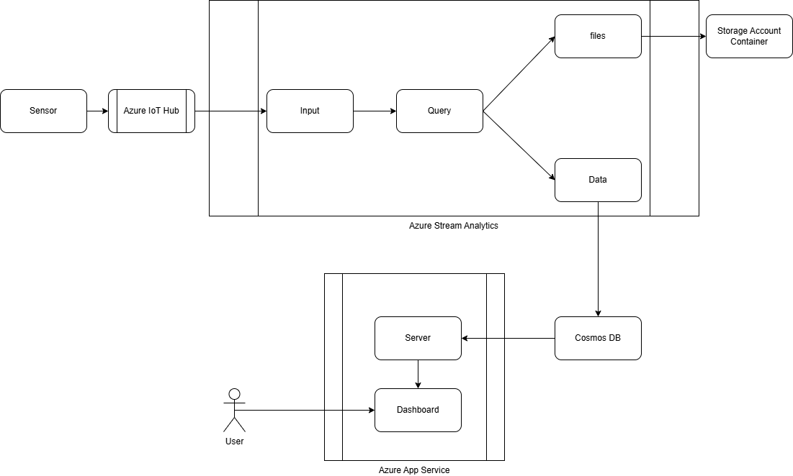
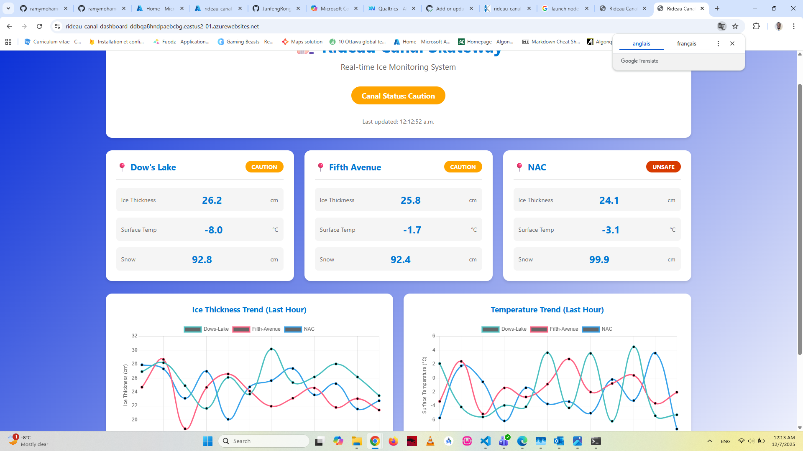
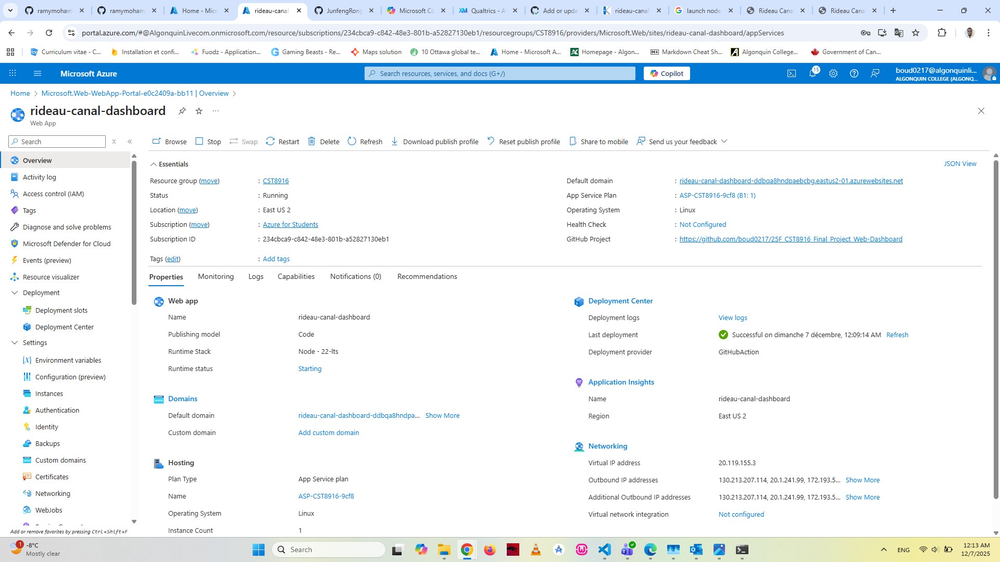
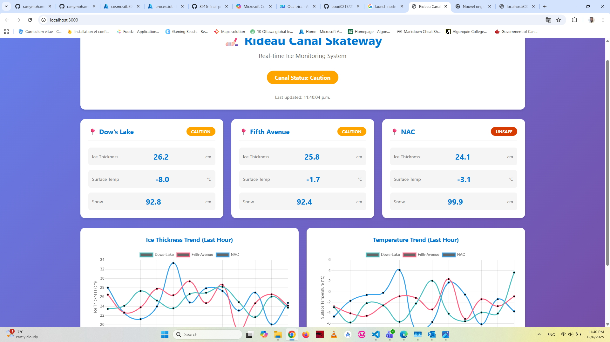

1. **Project Title and Description**
    - Rideau Canal Real-time Monitoring System
    - This system simulates IoT sensors deployed along Ottawa's Rideau Canal Skateway, creating a data pipeline that processes, stores, and visualizes real-time conditions to ensure safe skating
2. **Student Information**
    - Name: Dolsom Ostwald Corneille Bouda 041246719
    - Repositories links :  
            - Main Documentation Repository : https://github.com/boud0217/rideau-canal-monitoring  
            - Sensor Simulation Repository: https://github.com/boud0217/rideau-canal-sensor-simulation
            - Web Dashboard Repository : https://github.com/boud0217/25F_CST8916_Final_Project_Web-Dashboard

3. **Scenario Overview**
    - **Problem Statement**
        - The Rideau Canal Skateway is a  skating rink, attracting many visitors annually. Ensuring skater safety requires continuous monitoring of ice conditions, weather parameters, and environmental factors. Manual monitoring is inefficient and cannot provide real-time insights across the entire skateway. There is a critical need for an automated system that can collect, process, and visualize real-time data to enable proactive safety management and timely decision-making.
    - **System Objectives**
        - Simulate IoT sensors deployed at multiple locations along the Rideau Canal to generate realistic environmental and ice condition data
        - Build a scalable data pipeline to ingest, process, and store sensor data in real-time
        - Provide a web-based dashboard for visualizing current conditions, historical trends, and safety alerts
        - Demonstrate cloud-native architecture using Azure services for data processing and storage
4. **System Architecture**
    - **Architecture Diagram**
        - 
    - **Data Flow Explanation**
        1. **Data Generation**: Simulated IoT sensors generate real-time data including temperature, ice thickness, snow depth, and weather conditions
        2. **Data Ingestion**: Sensor data is transmitted to Azure IoT Hub, which acts as the central message broker for device-to-cloud communication
        3. **Stream Processing**: Azure Stream Analytics processes incoming data streams in real-time, performing aggregations and storing.
        4. **Data Storage**: Processed data is stored in Azure Cosmos DB and Azure Storage Account, providing low-latency access and global distribution capabilities
        5. **Visualization**: Azure App Service hosts the web dashboard that queries Cosmos DB and displays real-time conditions, historical trends, and safety alerts
    - **Azure Services Used**
        - **Azure IoT Hub**: Manages device connectivity, authentication, and bidirectional communication between sensors and the cloud
        - **Azure Stream Analytics**: Processes real-time data streams with SQL-like queries for filtering, aggregation, and pattern detection
        - **Azure Cosmos DB**: NoSQL database for storing sensor readings with high availability and low-latency access
        - **Azure Storage Account**: Stores historical sensor data in JSON files for long-term retention and analysis
        - **Azure App Service**: Hosts the web application dashboard for data visualization and user interaction

5. **Implementation Overview**
    - **Sensor Simulation**: Python-based IoT sensor simulator that generates and sends data to Azure IoT Hub at regular intervals. link : https://github.com/boud0217/rideau-canal-sensor-simulation
    - **Azure IoT Hub configuration**: Configure input using existing IoT Hub configurations
    - **Stream Analytics Job**: Set up Stream Analytics job to process incoming data and route it to Cosmos DB and Storage Account. Query :
    ```sql
    SELECT 
        IoTHub.ConnectionDeviceId AS ConnectionDeviceId,
        AVG(ice_thickness) AS AvgIceThickness,
        MIN(ice_thickness) AS MinIceThickness,
        MAX(ice_thickness) AS MaxIceThickness,
        AVG(surface_temperature) AS AvgSurfaceTemperature,
        MIN(surface_temperature) AS MinSurfaceTemperature,
        MAX(surface_temperature) AS MaxSurfaceTemperature,
        MAX(snow_accumulation) AS MaxSnowAccumulation,
        AVG(external_temperature) AS AvgExternalTemperature,
        COUNT(*) AS ReadingCount,
        System.Timestamp AS EventTime,
        CASE
            WHEN AVG(ice_thickness) >= 30 AND AVG(surface_temperature) <= -2 THEN 'Safe'
            WHEN AVG(ice_thickness) >= 25 AND AVG(surface_temperature) <= 0 THEN 'Caution'
            ELSE 'Unsafe'
        END AS SafetyStatus
    INTO
        [historical-data]
    FROM
        [IoTHubCST8915]
    GROUP BY
        IoTHub.ConnectionDeviceId, TumblingWindow(second, 300);


    SELECT 
        IoTHub.ConnectionDeviceId AS location,
        AVG(ice_thickness) AS AvgIceThickness,
        MIN(ice_thickness) AS MinIceThickness,
        MAX(ice_thickness) AS MaxIceThickness,
        AVG(surface_temperature) AS AvgSurfaceTemperature,
        MIN(surface_temperature) AS MinSurfaceTemperature,
        MAX(surface_temperature) AS MaxSurfaceTemperature,
        MAX(snow_accumulation) AS MaxSnowAccumulation,
        AVG(external_temperature) AS AvgExternalTemperature,
        COUNT(*) AS ReadingCount,
        System.Timestamp AS timestamp,
        CASE
            WHEN AVG(ice_thickness) >= 30 AND AVG(surface_temperature) <= -2 THEN 'Safe'
            WHEN AVG(ice_thickness) >= 25 AND AVG(surface_temperature) <= 0 THEN 'Caution'
            ELSE 'Unsafe'

        END AS SafetyStatus
    INTO
        [SensorAggregations]
    FROM
        [IoTHubCST8915]
    GROUP BY
        IoTHub.ConnectionDeviceId, TumblingWindow(second, 300);
    ```
    - **Cosmos DB setup**: Created Azure Cosmos DB account using Azure Portal with NoSQL API
        - Database: Created database to store sensor aggregations
        - Container: Created container with partition key `/location` for efficient querying by sensor location
        - Throughput: Configured with autoscale throughput to handle variable data ingestion rates
        - Integration: Connected as output in Stream Analytics job to receive processed sensor data
    - **Blob Storage configuration**: Created Azure Storage Account with blob container for historical data archival
        - Container: Created blob container to store raw sensor data in JSON format
        - Integration: Configured as output in Stream Analytics job for long-term data retention
    - **Web Dashboard**: web application hosted on Azure App Service. Link: https://github.com/boud0217/25F_CST8916_Final_Project_Web-Dashboard
        - Connects to Cosmos DB to retrieve and display real-time sensor aggregations
        - Visualizes ice conditions, temperature trends, and safety status for each location
    - **Azure App Service deployment**: Deployed web application using Azure Portal
        - App Service Plan: Created Linux-based App Service Plan with appropriate pricing tier
        - Runtime Stack: Configured NodeJS runtime environment for Flask application
        - Deployment: Deployed application code from GitHub repository using Azure Portal deployment center
        - Configuration: Added application settings for Cosmos DB connection string and environment variables
        - Access: Application accessible via Azure-provided URL for real-time monitoring dashboard


6. **Repository Links**
    - Main Documentation Repository : https://github.com/boud0217/rideau-canal-monitoring  
    - Sensor Simulation Repository: https://github.com/boud0217/rideau-canal-sensor-simulation
    - Web Dashboard Repository : https://github.com/boud0217/25F_CST8916_Final_Project_Web-Dashboard

7. **Video Demonstration**
    - **Video Demo:** [Demo link](https://youtu.be/R17pMpgNFWo)

8. **Setup Instructions**
    - Sensor Simulation Setup: https://github.com/boud0217/rideau-canal-sensor-simulation/blob/main/README.md
    - Web Dashboard Setup : https://github.com/boud0217/25F_CST8916_Final_Project_Web-Dashboard/blob/main/README.md

9. **Results and Analysis**
    - **Sample Outputs and Screenshots**
        - Dashboard displays real-time sensor data from multiple locations along the Rideau Canal
        - 
        - 
        - 
        - Each location shows aggregated metrics including ice thickness, surface temperature, snow accumulation, and safety status
    - **Data Analysis**
        - Stream Analytics processes sensor data in 5-minute tumbling windows, calculating averages, minimums, and maximums
        - Safety status is automatically determined based on ice thickness and surface temperature thresholds:
            - Safe: Average ice thickness ≥ 30cm and surface temperature ≤ -2°C
            - Caution: Average ice thickness ≥ 25cm and surface temperature ≤ 0°C
            - Unsafe: Conditions below caution thresholds
        - Historical data stored in Azure Storage Account enables trend analysis and long-term pattern identification
        - Cosmos DB provides low-latency queries for real-time dashboard updates
    - **System Performance Observations**
        - IoT Hub successfully handles multiple concurrent sensor connections with minimal latency
        - Stream Analytics processes incoming data streams in real-time with consistent 5-minute aggregation windows
        - Cosmos DB queries return results in milliseconds, enabling responsive dashboard experience
        - Azure App Service provides reliable hosting with automatic scaling capabilities
        - End-to-end latency from sensor data generation to dashboard visualization is typically under 10 seconds
        - System demonstrates scalability to handle additional sensor locations without performance degradation

10. **Challenges and Solutions**
    - **Challenge 1: Realistic Sensor Data Simulation**
        - **Solution**: Developed a Python-based simulator that generates random yet plausible environmental data, ensuring variability and realism in sensor readings.
    - **Challenge 2: Stream Analytics Query Complexity**
        - **Solution**: Iteratively refined SQL-like queries to accurately compute aggregations and safety status, testing with sample data to validate correctness.
    - **Challenge 3: Web Dashboard Integration**
        - **Solution**: Utilized Azure SDKs and REST APIs to seamlessly connect the dashboard application with Cosmos DB, ensuring real-time data retrieval and display.


11. **AI Tools Disclosure**
    We used Amazon Q to:
    - Generate the README files
    - Code the sensor
    - Troubleshoot the errors

12. **References**
    - Microsoft Azure Documentation: https://docs.microsoft.com/en-us/azure/
    - IoT Hub: https://docs.microsoft.com/en-us/azure/iot-hub/
    - Stream Analytics: https://docs.microsoft.com/en-us/azure/stream-analytics/
    - Cosmos DB: https://docs.microsoft.com/en-us/azure/cosmos-db/